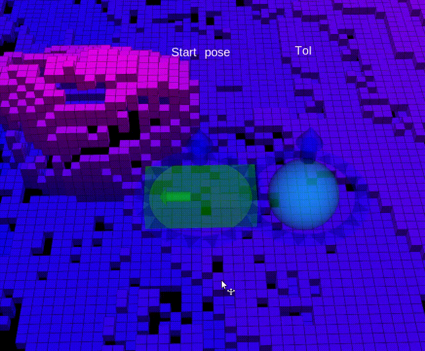
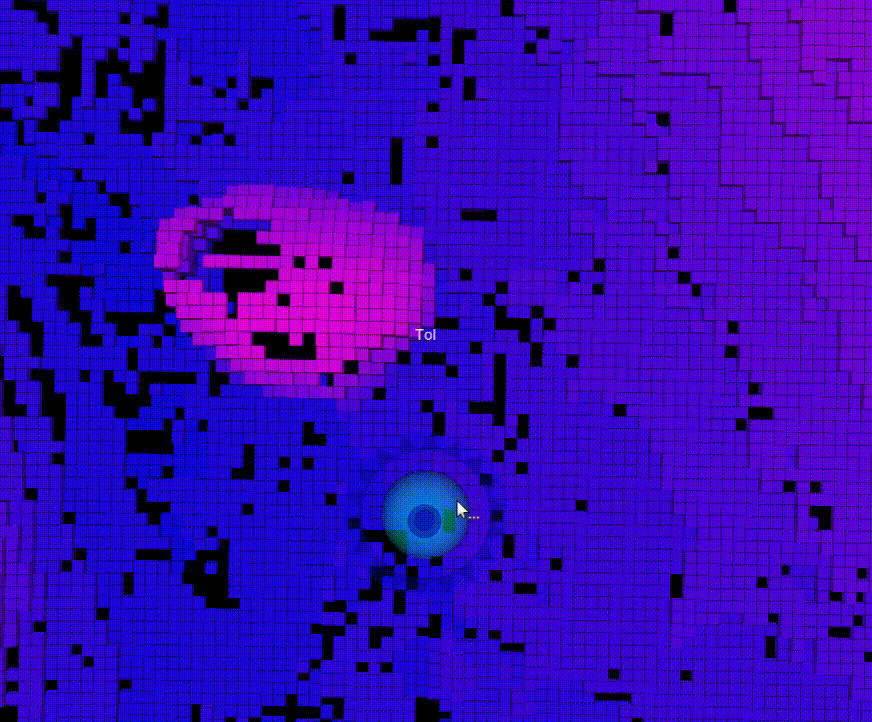

# SMUG Planner: A Safe Multi-Goal Planner for Mobile Robots in Challenging Environments


If you use this project for your research, please cite it using the following BibTeX entry:

```
@ARTICLE{Chen23,
    author = {Chen, Changan and Frey, Jonas and Arm, Philip and Hutter, Marco},
    journal={under review for IEEE Robotics and Automation Letters}, 
    title = {SMUG Planner: A Safe Multi-Goal Planner for Mobile Robots in Challenging Environments},
    year = {2023},
}
```
## Table of Contents

- [SMUG Planner: A Safe Multi-Goal Planner for Mobile Robots in Challenging Environments](#smug-planner-a-safe-multi-goal-planner-for-mobile-robots-in-challenging-environments)
  - [Table of Contents](#table-of-contents)
  - [Dependencies](#dependencies)
  - [Build](#build)
  - [Usage](#usage)
  - [License](#license)
  - [Credit](#credit)


## Dependencies

This project is developed using ROS Noetic and C++14, and has following dependencies:

- ompl
- protobuf (version 3.13.0)
- voxblox (branch fix/namespace_gflags, which contains the defintion for the height map and the traversability map)

To install the ompl, use:
```
sudo apt install ros-noetic-ompl
```

To install protobuf v3.13.0, download and untar
```
curl https://github.com/protocolbuffers/protobuf/releases/download/v3.13.0/protobuf-cpp-3.13.0.tar.gz
tar -xf ./protobuf-cpp-3.13.0.tar.gz
```

Untar, build and install 
```
cd protobuf-3.13.0
./configure
make
make check
sudo make install
sudo ldconfig
```
To setup voxblox, follow the instruction in [Build](#build).


## Build
Set up a catkin workspace
```
mkdir -p ~/smug_ws/src
cd ~/smug_ws
catkin init
```
Go to the `src` folder
```
cd src
```
Install system dependencies of voxblox
```
sudo apt-get install python-wstool python-catkin-tools ros-noetic-cmake-modules protobuf-compiler autoconf
```
Clone voxblox and its dependent repos
```
git clone git@github.com:leggedrobotics/voxblox.git -b fix/namespace_gflags
wstool init . ./voxblox/voxblox_ssh.rosinstall
wstool update
```
If you have already initalized wstool replace the above `wstool init` with `wstool merge -t`.

Clone and build smug_planner
```
git clone git@github.com:leggedrobotics/smug_planner.git
cd smug_planner
catkin build smug_planner_ros
```

## Usage

### Run the SMUG Planner 
```
roslaunch smug_planner_ros smug_planner.launch
```
### Send the maps
We provide a bag file containing the traversability map, the tsdf map and the height map of a lunar environment. Corresponding poinclouds are also contained for visualization.

Download the bag file under https://drive.google.com/file/d/1R-Xwv-AinsYTFaHucfnK4EvTVi20thjF/view?usp=share_link

Play the bag file to publish the maps
```
rosbag play <path-to-the-bag-file>
```

### Create a multi-goal mission

We provide two ways of setting the mission:

1. Publish a message containing the number of ToI and PoIs.

    ```
    rostopic pub /smug_planner/toi_config smug_planner_msgs/GoalConfig "n_set: <n_toi> n_goal_per_set: <n_poi>"
    ```
    Replace `<n_toi>` with the number of Target of Interest (ToI), and `<n_poi>` with the number of Pose of Interest (PoI) of each ToI, e.g.
    ```
    rostopic pub /smug_planner/toi_config smug_planner_msgs/GoalConfig "n_set: 5 n_goal_per_set: 10"
    ```
    This example will generate a mission of visiting 5 ToI at respective PoI, in which 10 PoI are placed equidistantly around each ToI.

    Once the message is published, the planner will start planning and the result can be visualized in the rviz under the topic `/smug_planner/path_buffer`

    The following demo plans over 13 ToIs and 10 PoIs each and finishes in less than a second on a laptop with i7-12800HX CPU.
    

2. Set the mission with interactive markers.
    
    Run the mission_publisher_node
    ```
    rosrun smug_planner_ros mission_publisher_node.py
    ```
    Set the robot start pose with the box interactive marker, click the box to confirm. To adjust it, move the marker and click again.
    
    

    Set the ToIs with the sphere interactive marker, click to open the menu, type or select the desired PoI number from the entry `Set PoI number`. Move the marker to ajust. To change the PoI number, selecting or typing the desired number again. Select the entry `Spawn` to confirm. To undo the already set mission, select the entry `Clear mission`, this will clear all set ToIs and PoIs.

    
   

    After the mission is all set, select the entry `Send mission` to publish the mission. 

    
    
    Note: 
    
    In the config.yaml, set
    ```
    mission:
        plan_with_valid: true   
    ```
    to make the planner plan with the valid PoIs, otherwise the mission aborts if some given PoIs are invalid. The validity informations are visualized in rviz.

    Increase `max_stall` to make the paths finer at the cost of longer computation.


## License

The project is licensed under the MIT license.

## Credit
The project uses the TSP solver from google or-tools.